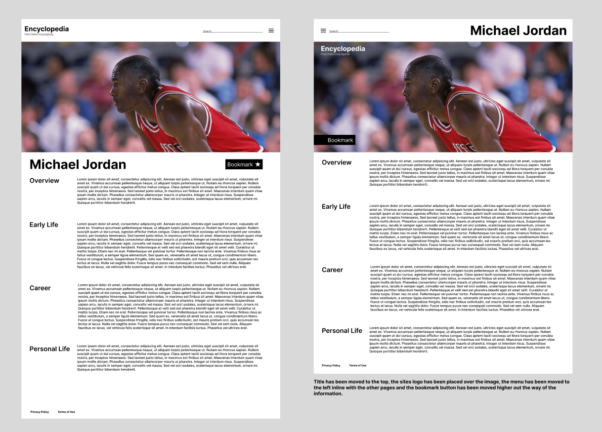
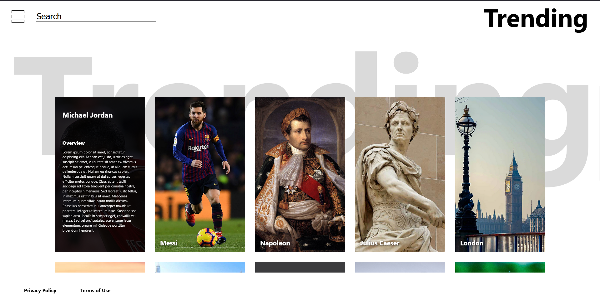

# Dux Assessment 3

## 1. Wireframe Revision

## 2. Project Explaination
   
This project is an online encylopedia that aims to modernise traditional online encyclopedias e.g. wikipedia.
This will be accomplished by incorporating features such as a trending page and the ability to save articles to a favorites page.

## 4. Value to Users Explaination
The website has accomplished all the users requirements form the user stories.
the website effectively displays information, has the framework to bookmark pages and has entertaining ways to discover new information through the trending page.

## 5. Finished Product Screeenshots
Below are images of the final website

